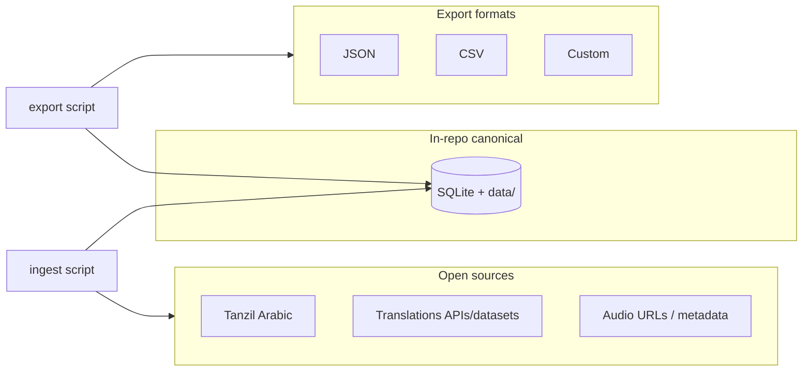

# Complete Quran Dataset Project

## Current state

- Repo is a **stub**: only [README.md](README.md) and [LICENSE](LICENSE). No data, scripts, or config.
- Goal: full dataset in a canonical format **committed in the repo**, plus export to JSON/CSV and other formats via scripts. Add features beyond the README to make this the best open-source Quran dataset.

## Architecture overview




- **Canonical store**: SQLite database plus optional human-readable files under `data/` (e.g. one JSON per surah) so the “full dataset in our format” is clear and diff-friendly.
- **Ingest**: One-time (or occasional) Python script that pulls from open sources (Tanzil, known translation/audio sources), validates, and writes into the canonical store and `data/`; output is committed.
- **Export**: Python script that reads the canonical store and writes JSON, CSV, or custom formats with field-level selection.

## Data model (canonical schema)

- **Surahs**: `id` (1–114), `name_ar`, `name_en`, `translated_name` (optional), `revelation_place` (Meccan/Medinan), `verse_count`, `order`.
- **Verses**: `surah_id`, `ayah_number`, `verse_key` (e.g. `1:1`), `text_uthmani` (Arabic, Uthmani), `text_simple` (optional), `juz`, `page` (Mushaf page 1–604), `rub_el_hizb` (optional), `sajdah` (optional).
- **Translations**: `verse_id` (or verse_key), `lang_code`, `translator`, `text`; support multiple languages/editions.
- **Transliterations**: `verse_id` / `verse_key`, `lang_code` (e.g. `en`), `text`.
- **Audio**: `verse_key` or `ayah_id`, `reciter_id`, `url` or `segment_urls`; optional `duration_sec`, `timestamp_ranges` (start/end per verse or segment).
- **Metadata**: Optional tables or columns for word-by-word (Arabic + translit), tafsir references, or ruku.

Standard counts: 114 surahs, 6,236 verses (Hafs), 30 juz, 604 pages. Schema will support this and document the choice.

## Project layout

```
quran-dataset/
├── README.md
├── LICENSE
├── CONTRIBUTING.md
├── docs/
│   ├── DATA_SOURCES.md          # Provenance, licenses, attribution
│   ├── SCHEMA.md                # Canonical schema and field descriptions
│   └── EXPORT_USAGE.md          # How to run export, examples
├── schema/
│   └── schema.sql               # SQLite DDL for canonical DB
├── data/                         # Canonical dataset (committed)
│   ├── quran.db                  # SQLite (primary canonical store)
│   ├── surahs.json               # Surah metadata (optional mirror)
│   └── verses/                   # Optional: 114 files verses_001.json .. verses_114.json
├── sources/                      # Scripts/fetchers and source config
│   ├── config/
│   │   └── sources.yaml          # URLs, licenses, mapping to schema
│   └── (optional) cache/         # .gitignored; downloaded raw data
├── scripts/
│   ├── requirements.txt
│   ├── ingest.py                 # Fetch from sources → validate → write to data/
│   ├── export.py                 # Read data/ → JSON/CSV/custom with field selection
│   ├── validate.py               # Validate data/quran.db and data/verses/*.json
│   └── lib/
│       ├── db.py                 # DB helpers
│       ├── export_formats.py     # JSON/CSV/custom writers
│       └── schema_loader.py      # Load schema, apply migrations if any
├── exports/                      # (Optional) pre-built samples; can be .gitignored or in releases
│   ├── sample_full.json
│   ├── sample_flat.csv
│   └── sample_minimal.json
└── .gitignore
```

## Implementation plan

### 1. Repo foundation and docs

- Add [.gitignore](.gitignore): `sources/cache/`, `__pycache__/`, `*.pyc`, `.env`, optional `exports/` if generated.
- Extend [README.md](README.md): project overview, quick start (clone, optional venv, run export), link to DATA_SOURCES, SCHEMA, EXPORT_USAGE, and feature list below.
- Add [CONTRIBUTING.md](CONTRIBUTING.md): how to run ingest/export/validate, add a new translation/audio source, and attribution rules.
- Add [docs/DATA_SOURCES.md](docs/DATA_SOURCES.md): list sources (e.g. Tanzil for Arabic — CC BY 3.0; translation/audio sources with licenses and attribution). State that text must not be altered per Tanzil and attribution required.
- Add [docs/SCHEMA.md](docs/SCHEMA.md): tables (surahs, verses, translations, transliterations, audio, etc.), field types, and meaning (e.g. verse_key, juz, page).
- Add [docs/EXPORT_USAGE.md](docs/EXPORT_USAGE.md): `python scripts/export.py` examples (full JSON, CSV, field selection, custom format).

### 2. Canonical schema and SQLite

- Add [schema/schema.sql](schema/schema.sql): CREATE TABLE for surahs, verses, translations, transliterations, audio (and optional tafsir/word tables). Use verse_key + surah_id/ayah_number for joins. Indexes for verse_key, surah_id, lang_code.
- Document in SCHEMA.md which fields are required vs optional and standard counts (114, 6236, 30, 604).

### 3. Ingest pipeline (Python)

- Add [scripts/requirements.txt](scripts/requirements.txt): `requests`, `pyyaml`, and optionally `lxml` or `beautifulsoup4` if parsing HTML/XML.
- Implement [scripts/ingest.py](scripts/ingest.py):
  - Read [sources/config/sources.yaml](sources/config/sources.yaml) for source URLs and mappings (Tanzil XML/text, translation JSON/CSV URLs, audio manifest URLs).
  - Fetch Arabic from Tanzil (or a well-known JSON derived from Tanzil with correct attribution). Map to verses (surah, ayah, text_uthmani, page, juz if available).
  - Fetch at least one full translation (e.g. English) from an open API/dataset; map to translations table (verse_key, lang_code, translator, text).
  - Optionally: transliteration source, audio metadata (reciter, URL pattern or segment list), and tafsir references.
  - Validate row counts and key fields (no empty verse_key, valid surah/ayah ranges).
  - Write to `data/quran.db` (create tables from schema.sql) and optionally mirror to `data/surahs.json` and `data/verses/*.json` for readability.
- Ingest must be idempotent (replace or upsert) and print clear attribution text for each source (to be included in DATA_SOURCES.md and optionally in exports).

### 4. Export pipeline (Python)

- Implement [scripts/export.py](scripts/export.py) with CLI (e.g. `argparse` or `click`):
  - `--format json|csv|custom`
  - `--output <path>`
  - `--fields surah_id,ayah_number,verse_key,text_uthmani,translation_en` (field-level selection)
  - `--surah 1-3` or `--surah 1,2,3` (limit to surahs)
  - `--lang en` (filter translations by language)
- Implement [scripts/lib/export_formats.py](scripts/lib/export_formats.py):
  - **JSON**: nested (surahs → verses → fields) and/or flat (one object per verse with surah/ayah fields). Option for minimal (id, verse_key, text, translation) and full (all columns).
  - **CSV**: one row per verse; columns = selected fields; multi-value fields (e.g. multiple translations) as separate columns or JSON string per project preference.
  - **Custom**: template-based or a simple DSL (e.g. column list + delimiter) so users can get “custom” without editing code; document in EXPORT_USAGE.md.
- Export reads from `data/quran.db` (and optionally from `data/verses/*.json` if you want to support both). No write to canonical store.

### 5. Validation script

- Add [scripts/validate.py](scripts/validate.py): check `data/quran.db` (and optional `data/verses/`) for row counts (114 surahs, 6236 verses), required fields non-null, verse_key format, referential consistency (translations/audio reference existing verses). Exit non-zero and print errors if invalid.

### 6. Full dataset content (run ingest and commit)

- Add [sources/config/sources.yaml](sources/config/sources.yaml) with at least:
  - Tanzil (or a CC-BY-attributed JSON/text source) for Arabic Uthmani.
  - One or two open translation sources (e.g. English, with clear license).
  - Optional: transliteration and audio URL templates.
- Run `ingest.py` once (or document exact steps in CONTRIBUTING.md), then commit:
  - `data/quran.db`
  - `data/surahs.json` (if generated)
  - `data/verses/*.json` (if generated)
  So the repo truly contains the “full dataset in our format.”

### 7. Pre-built export samples

- Run `export.py` to produce `exports/sample_full.json`, `exports/sample_flat.csv`, and `exports/sample_minimal.json` (e.g. first few surahs or full). Commit these so users can see output shape without running scripts; optionally also attach same (or full) exports in GitHub Releases.

### 8. Features beyond README (make it “best available”)

- **Tafsir support**: Schema + optional ingest for tafsir references or short excerpts (with source and license in DATA_SOURCES.md).
- **Word-by-word**: Optional table or JSON field for Arabic word + transliteration per verse (if a licensed source is available); otherwise document as future.
- **Multiple export shapes**: Document and support at least “nested” and “flat” JSON; “minimal” vs “full” CSV columns.
- **Attribution and licensing**: Every export (or README) mentions DATA_SOURCES.md; optional `--include-attribution` flag that appends a short attribution block to the exported file or stdout.
- **Validation in CI**: Example GitHub Action that runs `validate.py` on `data/quran.db` so PRs don’t break the canonical dataset.
- **Versioning**: Optional `dataset_version` or `schema_version` in DB or a small `data/version.json` (e.g. 1.0.0, date) for traceability.
- **README feature list expansion**: Add to README: tafsir, word-by-word (if implemented), validation, multiple JSON/CSV shapes, attribution, and “offline-first, no API key, reproducible build.”

## Data sources and attribution (for users and docs)

Document these in **docs/DATA_SOURCES.md** and in **sources/config/sources.yaml** (with `license`, `url`, `attribution_text` per source). Optionally add an `--include-attribution` flag to the export script that appends a short block to the output.

### 1. Arabic (Uthmani) text — Tanzil Project

- **Source:** Tanzil Project
- **URL:** [https://tanzil.net/download](https://tanzil.net/download)
- **License:** Creative Commons Attribution 3.0 (CC BY 3.0)
- **Terms:** Verbatim copy and distribution allowed; changing the text is not allowed. Source must be clearly indicated with a link to tanzil.net.
- **Updates:** [http://tanzil.net/updates/](http://tanzil.net/updates/)

**Attribution text to use (verbatim or in docs):**

```
Arabic Quran text: Tanzil Quran Text
Copyright (C) 2007-2021 Tanzil Project
License: Creative Commons Attribution 3.0
Source: https://tanzil.net/
This text may not be modified. See https://tanzil.net/docs/Text_License
```

**Technical:** Download from [https://tanzil.net/download](https://tanzil.net/download) (XML, Text, or SQL). Alternative: GitHub mirror [acfatah/tanzil](https://github.com/acfatah/tanzil) (same CC BY 3.0; credit Tanzil Project).

---

### 2. Translations (examples — verify license per edition)

Use only editions with clear open licenses. Document each edition in DATA_SOURCES.md with translator name, language, and exact license/attribution.

**Tanzil translations** ([https://tanzil.net/trans/](https://tanzil.net/trans/)): multiple languages; check each translation’s license on the site.

**Example attributions (adapt per edition):**

- **English (Saheeh International):** Often distributed via Tanzil; attribute “Translation by Saheeh International. Source: Tanzil ([https://tanzil.net/trans/).”](https://tanzil.net/trans/).”) and state the license stated by Tanzil for that edition.
- **Other projects:** e.g. Quran JSON API ([https://quran-json-api.vercel.app/data-sources](https://quran-json-api.vercel.app/data-sources)) lists Tanzil.net translations (Russian, French, Spanish, English, Bengali) and other sources (Chinese, Urdu, Turkish, Swedish, Indonesian); that project uses CC-BY-SA 4.0 — if we use their data, we must comply with CC-BY-SA 4.0 and attribute them and the original translators.

**In sources.yaml:** For each translation source store: `name`, `url`, `license`, `attribution_text`, `translator` (or `edition_id`).

---

### 3. Transliteration (e.g. English / Latin)

- **Tanzil.net:** English transliteration available; same attribution as Tanzil (CC BY 3.0, no modification, link to tanzil.net).
- **Attribution:** Include “Transliteration: Tanzil Project ([https://tanzil.net](https://tanzil.net)). License: CC BY 3.0.” in DATA_SOURCES.md and in export attribution if used.

---

### 4. Metadata (surah names, juz, page, revelation place)

- **Tanzil Quran Metadata:** [https://tanzil.net/docs/Quran_Metadata](https://tanzil.net/docs/Quran_Metadata) — use for structure (surah names, verse counts, juz, page). Attribute Tanzil Project and link to tanzil.net.
- **Attribution:** “Quran metadata (surah names, juz, page): Tanzil Project, [https://tanzil.net/docs/Quran_Metadata”](https://tanzil.net/docs/Quran_Metadata”)

---

### 5. Audio (if included)

- Use only sources that grant redistribution and state so clearly (e.g. Quran.com API, or reciters’ official CDNs with stated terms). For each reciter/source add to DATA_SOURCES.md: provider name, URL, license/terms, and attribution text.
- Example: “Audio: [Reciter name]. Source: [URL]. [License/terms].”

---

### 6. What to ship in the repo

- **docs/DATA_SOURCES.md:** Table or list of every source (Arabic, translations, transliteration, metadata, audio) with: name, URL, license, and the exact attribution text users must preserve.
- **sources/config/sources.yaml:** Same info in machine-readable form so the ingest script can log or embed attribution.
- **Export script:** Optional `--include-attribution` that appends a concise “Data sources” block (or path to DATA_SOURCES.md) to the exported file so users know how to credit.

This gives users a single place to see where data came from and how to give proper attribution.

---

## Source and license compliance

- **Arabic**: Use only sources that allow redistribution with attribution (e.g. Tanzil CC BY 3.0). Do not alter Arabic text; keep attribution in DATA_SOURCES.md and optionally in export metadata.
- **Translations / transliteration / audio**: Only include sources that are clearly open (MIT, CC, or public domain). Document each in DATA_SOURCES.md and in `sources.yaml` (license, URL, attribution text).

## Order of work (suggested)

1. Repo foundation: .gitignore, CONTRIBUTING.md, docs (DATA_SOURCES, SCHEMA, EXPORT_USAGE), README update.
2. Schema: schema.sql and SCHEMA.md.
3. Scripts: requirements.txt, lib (db, schema_loader, export_formats), ingest.py (Tanzil + one translation + optional translit/audio), validate.py, export.py.
4. sources/config/sources.yaml and one successful ingest run; commit data/.
5. Generate and commit exports/ samples; optional CI for validate.
6. Extra features: tafsir schema + ingest if source available, word-by-word if feasible, attribution flag, version file, README feature list.

This delivers the full dataset in your canonical format (SQLite + optional JSON mirror) committed in-repo, exportable to JSON/CSV/custom via a single Python export script with field selection, plus validation, docs, and extras that go beyond the current README and align with best open-source Quran datasets.